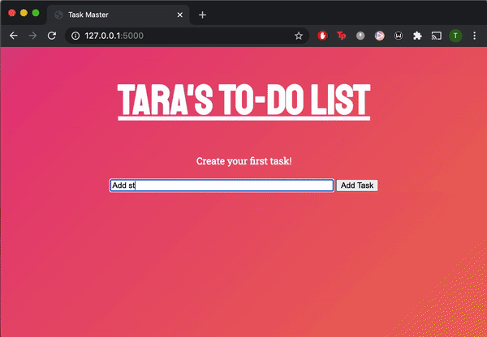

# Tara's To-Do List

Simple Flask App to keep track of my day to day tasks!

## Installation and Usage

- `pipenv install -r requirements.txt`
- `pipenv shell`
- Tell terminal which application to work with:
  - `export FLASK_APP=app.py` (Linux/MacOS/GitBash)
  - `set FLASK_APP=app.py` (Windows Command Prompt)
  - `$env:FLASK_APP = "app.py"` (PowerShell)
- Tell terminal which environment to work in:
  - `export FLASK_ENV=development` (Linux/MacOS/GitBash)
  - `set FLASK_ENV=development` (Windows Command Prompt)
  - `$env:FLASK_ENV="development"` (PowerShell)
- `flask run`
